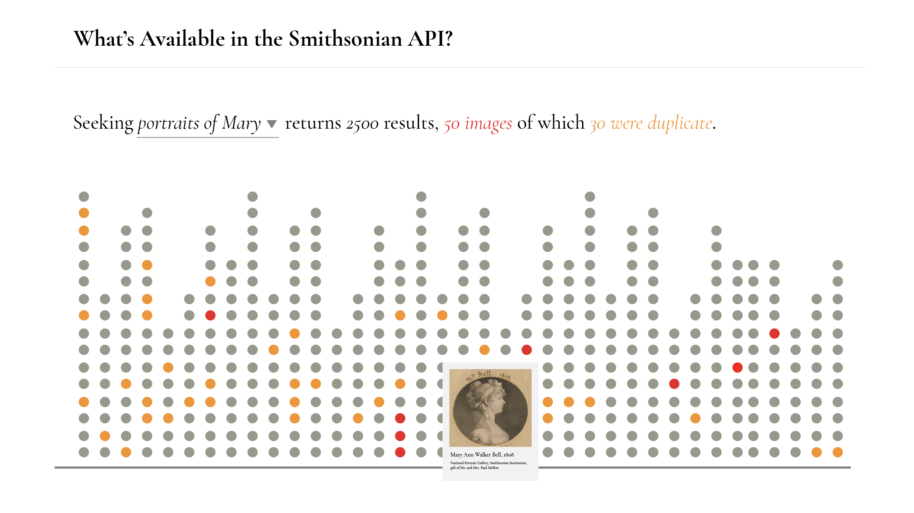
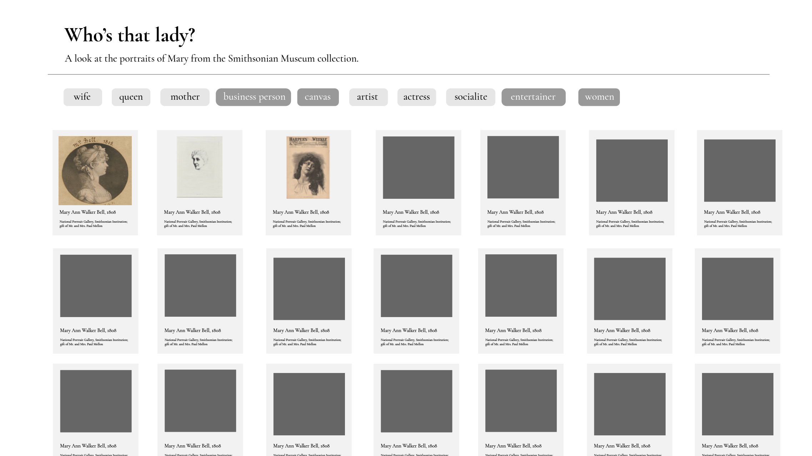
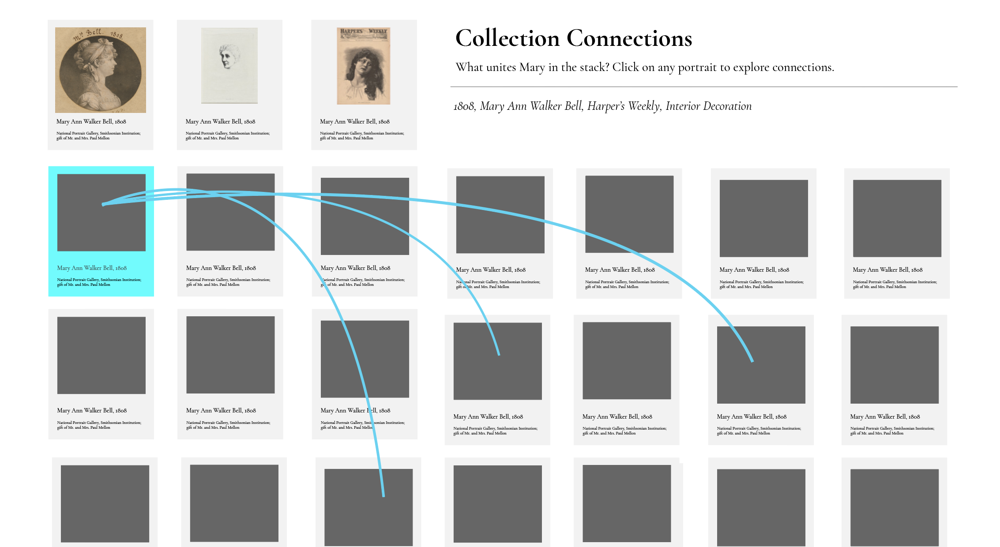
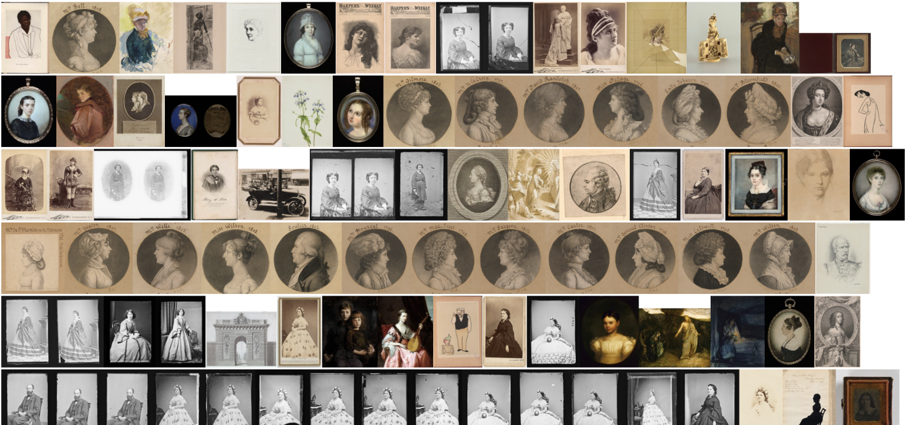

# major-studio-1-fa20

Project 1 mocks: 
(Mock 1 Quantity focus, will use several api searches)
  
(Mock 2 Tagged results)
  
(Mock 3 Connections - not really quantative so probably abandoning this idea)
  
Examples of images available (about 200 images across 2500 results, several duplicates)

